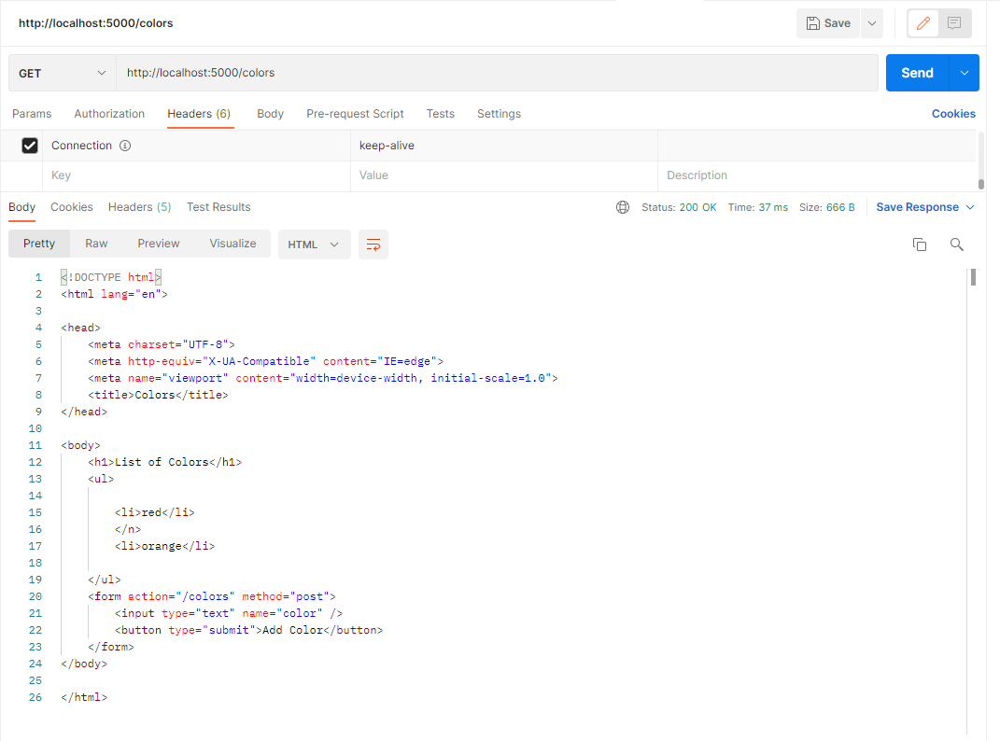
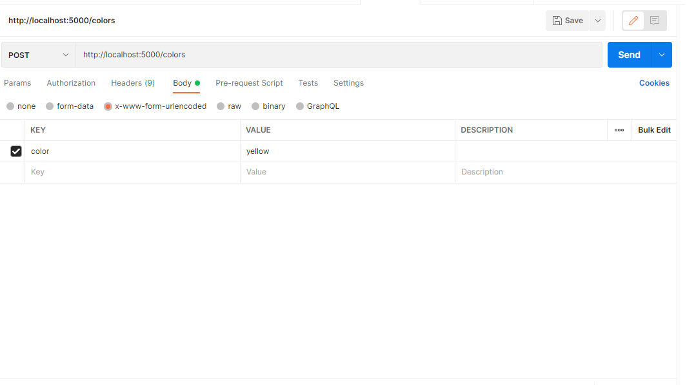

# W8D1

## Basic Server Objectives

Below is a complete list of the basic server objectives for this lesson. When
you complete this lesson, you should be able to perform each of the following
objectives. These objectives capture how you may be evaluated on the
assessment for this lesson.

-   **Explain the role of a server in a fullstack application**\
    <b><span style="color:CornflowerBlue">Answer:</span></b>

    A `server` is a hardware or software that receives and returns data across a
    network.\
    A `full-stack application` is an application that has a front-end client and
    a back-end server.\
    The `front-end client` requests data from the back-end server, it is
    responsible for displaying the data or web pages to a user.\
    The `back-end server` response data to the front-end client and provides a
    multitude of functionalities such as:

    -   Send the requested web pages
    -   Process data
    -   Store and send data in a database

-   **Compare and contrast the traditional front and back ends of a web
    application**\
    <b><span style="color:CornflowerBlue">Answer:</span></b>

    A traditional front and back end of a web application contain a
    `request-response` cycle.\
    It is the communication pattern between a `client`, and a `server`.\
    The front end is the `client` and the back end is the `server`.\
    A user interacts with the `client` / `broswer` which would make requests to
    a **server**\
    The `server` then sends back responses containing the data depending on the
    requests being made.\
    The `clients` role in the traditional web application besides making
    requests to the `server`.

    -   Parses HTML, CSS, and JS
    -   Renders that information to the user by constructing and rendering a DOM
        tree

    The `servers` role in the traditional web application besides responding
    with data to the `client`

    -   Creates new data on the database
    -   Reads data from the database
    -   Updates data on the database
    -   Deletes data on the database

-   **Define HTTP and its role in sending information between a server and
    client**\
    <b><span style="color:CornflowerBlue">Answer:</span></b>

    `HT-: HyperText`

    -   Hypertext is simply "content with references to other content"
    -   Hypertext is what makes the Web a "web", and it's the most fundamental
        part of how we interact online.

    `-TP: Transfer Protocol`

    -   Protocol, in computer science, a set of rules or procedures for sending
        data across electronic devices.

    `HTTP`

    -   defines the expectations of exchanging hypertext between systems
    -   works betweeen clients aand servers
        -   `client`: data consumer, usually web browser
        -   `server`: data provider, often where app is running
    -   common HTTP exchange: request/response cycle
        -   `client` sends request to server for particular resource: a webpage,
            image or application data.
        -   `server` sends back a response containing reseource or explanation
            why it can't provide the resource.

-   **Write a request to fetch a specific piece of information from a server**\
    <b><span style="color:CornflowerBlue">Answer:</span></b>

    ```js
    fetch("/api/products/", {
    	method: "GET",
    	headers: {
    		"Content-Type": "application/json",
    		"XSRF-TOKEN": `Ttm4I6MN-7V13QoTuzr4FLq4Dy8jyA28EtZE`,
    	},
    });
    ```

    #### Structure of the fetch request above

    Fetch is the function we are using passing in a URL getting all the products,\
    Specifying the **method** to use\
    Adding in **headers** specifying the type of data we are sending,\
    and the authentication required inorder to access the data.

-   **Write code to interpret a response from a server and handle success or
    failure**\
    <b><span style="color:CornflowerBlue">Answer:</span></b>

    ```js
    const res = fetch("/api/users/edit", {
    	method: "PUT",
    	headers: {
    		"Content-Type": "application/json",
    		"XSRF-TOKEN": `Ttm4I6MN-7V13QoTuzr4FLq4Dy8jyA28EtZE`,
    	},
    	body: JSON.stringify({
    		fullName: "demo",
    		headline: "This a demo",
    		website: "demo@demo.io",
    	}),
    });

    res.then(res => res.json())
    	.then(data => console.log(data))
    	.catch(err => console.log(err));
    ```

    #### Handling Success or Failure

    A fetch requests returns a `Promise` object.\
    A `Promise` object takes up to two arguments: both callback functions for
    sucess and failure.\
    A `Promise` comes in three states:

    -   <em>pending</em> default state, and in neither of the states.
    -   <em>fulfilled</em> the operation was sucessful
    -   <em>rejected</em> the operation failed

    **resolve** == success\
    **reject** == failure\

    When a `Promise` is fulfilled/successful the `.then` is invoked taking in
    the return value from the **resolve** function and in the code above parsing
    the data into a json object and then showing that data.\

    When a `Promise` is rejected/failed the `.catch` is invoked taking in the
    return value from the **reject** function, and in the code above when an
    error occurs we simply show the error.

-   **Match HTTP verbs (GET, PUT, PATCH, POST, DELETE) to their common uses**\
    <b><span style="color:CornflowerBlue">Answer:</span></b>
    | Methods | Uses |
    | ------- | ---- |
    | GET | Direct requests asking for data. Does not contain a body, headers are optional. |
    | PUT | Updates a resource. Contains all the information to be updated. |
    | PATCH | Updates a resource. Usually the identifier and the specific fields to be updated. |
    | DELETE | Deletes a resource. Removing data from the server, deleting sessions. |

-   **Match common HTTP status codes (200, 302, 400, 401, 402, 403, 404, 500) to
    their meanings**\
    <b><span style="color:CornflowerBlue">Answer:</span></b>
    | HTTP Status | Meaning |
    | ----------- | ------- |
    | 100s | `Informational`, provides extra info from the server. |
    | 200s | `Successful`, the server is handling it.<br><br>--200 **OK**: Received and fulfilled. Comes with a body that contains the resources. |
    | 300s | `Redirection`, lets the client know a change in the URL path and should be redirected there.<br><br>--302 **Found**: A resource has temporarily moved. Can also indicate a permanent move but the <br>old URL path should still be valid.|
    | 400s | `Client Error`, indicates that there is a problem with the client's request.<br>Missing resource or typo's on the request.<br>--401 **Unauthorized**: The resource may exist, but you're not allowed to access it without<br>authentication.<br><br>--402 **Payment Required**: The resource can't be accessed until the client makes a payment.<br><br>--403 **Forbidden**: The resource may exist, you lack the required permission to access the <br>resource.<br><br>--404 **Not Found**: The resource you requested doesn't exist. The resource no longer exists,<br>or a typo has been made on the requested resource. |
    | 500s | `Server Error`, an internal problem with the server.|

-   **Determine the purpose of a RESTful route by its HTTP method and URI**
    <b><span style="color:CornflowerBlue">Answer:</span></b>\
    | Path Pattern | HTTP Verb/Method | Meaning |
    | ------------ | ---------------- | ------- |
    | /resource-name | **GET** | Get the data based on the resource. |
    | /resource-name/new | **GET** | Creates a form page. Form to create a new record for the resource. |
    | /resource-name | **POST** | Submit data. Creates a new record for the resource. |
    | /resource-name/:record-id | **GET** | Get the data of a specific resource. |
    | /resource-name/:record-id/edit | **GET** | Edit form page: Show edit form of the specific resource. |

-   **Appropriately construct a body for an HTTP request**\
    <b><span style="color:CornflowerBlue">Answer:</span></b>

    To appropriately construct a body:

    -   Set the appropriate `content-type` in the header.
    -   Comes right after the header
    -   When sending data that doesn't fit in the header and is too complex for
        the URI

-   **Identify common values of the `Content-Type` header and how they're
    interpreted**\
    <b><span style="color:CornflowerBlue">Answer:</span></b>

    #### **Common Value Types**

    1. `Application`, any kind of binary data that doesn't fall into one of the
       other types, or binary data that requires a specific application or a
       category of an application to use\
       Examples:
        1. application/xml
        2. application/json
        3. application/javascript
        4. application/x-www-form-urlencoded
    2. `Audio`, audio or music data.\
       Examples:
        1. audio/mpeg
        2. audio/x-ms-wma
        3. audio/vorbis
        4. audio/x-wav
    3. `Image`, image or graphical data including both bitmap, vector still
       images, animated images such as GIF's.\
       Examples:
        1. image/png
        2. image/svg+xml
        3. image/gif
        4. image/jpeg
        5. image/x-icon
    4. `Video`, video data or files.\
       Examples:
        1. video/mpeg
        2. video/mp4
        3. video/quicktime
        4. video/webm
    5. `Text`, simple text data that is human-readable, textual data or source
       codes.\
       Examples:
        1. text/plain
        2. text/css
        3. text/html
        4. text/csv
    6. `Multipart`, multiple components of data which may have different MIME
       types.\
       Examples:
        1. multipart/form-data
        2. multipart/mixed
        3. multipart/byteranges
        4. multipart/alternative

-   **Use Postman to explore and test a remote server by sending requests and
    interpreting the responses**\
    <b><span style="color:CornflowerBlue">Answer:</span></b>

    Using a GET method on the colors resource.\
    Response status is 200 OK meaning the request was successfully handled.\
    The body contains an text/html. The client/browser would then show the user.
    

    Using a GET method uses the default headers.
    

    Using a POST method on the colors resource.
    Response status is 200 OK meaning the request was successfully handled and a
    new record is made.
    Same as the get the body contains an text/html.
    

    Using a POST method, postman automatically detects the content-type being
    sent and the content length and appropriately sets it
    In this case we are sending a application/x-www-form-urlencoded type
    

    A POST requires a body in which we add all our information about the
    resource to create a new record.
    

---


# W8D2

## Servers Request Response Learning Objectives

## 1. Build a server using the http package

 - First we start off by requiring the `http` package. Then we use http's `creatServer` method that takes in an optional `requestListener` function its a function that gets exectued each time the server gets a requests. We create a function within our `requestListener` function that would parse the request body.
 We then create a port and have our server listen to the port.

 ```javascript
    /*  syntax for a `requestListener` */
    function(request, response){

    }

    /* server using http package */

    const http = require('http');

    const server = http.createServer((req, res) => {
        let reqBody = '';
        req.on('data', (data) => {
            reqBody += data;
        });

        req.on('end', () => { // After the assembly of the request body is finished
            /* ==================== PARSE THE REQUEST BODY ====================== */
            if (reqBody) {
            req.body = reqBody
                .split("&")
                .map((keyValuePair) => keyValuePair.split("="))
                .map(([key, value]) => [key, value.replace(/\+/g, " ")])
                .map(([key, value]) => [key, decodeURIComponent(value)])
                .reduce((acc, [key, value]) => {
                    acc[key] = value;
                    return acc;
                }, {});
            }
        })

        /* route handlers */
    });

    const port = 5000;

    server.listen(port, () => console.log('Server is listening on port', port));

 ```

## 2. Compare and contrast the Request and Response objects in the http package
 - Requests:
 1. `Request-line` the first line of an HTTP request, and it sets the stage for everything to come. It's made up of three parts, seperated by spaces:

    - the method, indicated by an HTTP verb,
    - the URI (Uniform Resource Indicator) that identifies what you've requested,
    - and the HTTP version you expect to use (usually HTTP/1.1 or HTTP/2).

 The URI identifies the requested resource. A resource can be anything from physical objects to statuses to a kind of information.

 2. Headers are key/value pairs that come after the `request-line`.
    They each appear on seperate lines and define the metadata needed to process the request.

 3. Body, when sending data that doesn't fit in a header & is too complex for the URI, the data can be placed in the body of our HTTP request. To tell the server how to interpret your body, it's important to set the `Content-Type` header.

 4. HTTP verbs are a simple way of declaring the intention of the request to the server.

 5. `Content-Type` Header any header beginning with `Content-` are headers that define details about the body of the request. Content headers will only show up on requests that support content in the body, so `GET` requests should never have any content heeaders.

 - Response:
 1. Responses are formated similarly to requests: there's a status line instead of a request-line), headers that provide helpful metadata about the response, and the response body: a representation of the requested resource.

 2. Status, response's first line(aka `status-line`) gives you a high level overview of the server's intention.
 200 is the `Status-Code`
 OK is the `Reason-Phrase`

 ```
    HTTP/1.1 200 OK
 ```

 3. Just like the `Content-Type` header of a request, the `Content-Type` header of a resposne lets the client know the format of the response body and how to process it.

 3. If a successful request, the body of the response contains the resource you've requested.


## 3. Formulate and send a response based on the components of a request
 - Read the method and URI of a request
 - Write the body of a response
 - Set the status code of a response
 - Read the headers of a request
 - Set the headers of a response
 - Send a response

```javascript
    /* Example 1 for home page */
    if (req.method === "GET" && req.url === "/") {
        const resBody = "Response Body";
        res.statusCode = 200;
        res.setHeader('Content-Type', 'text/html');
        res.write(resBody);
        return res.end();
    }

    /* Example 2 for a specific resource */
    if (req.method === "POST" && req.url === "/candy") {
      const { flavor, type } = req.body;

      if (!name) {
        const resBody = JSON.stringify("Something is wrong with the body.");
        res.statusCode = 400;
        res.setHeader('Content-Type', 'application/json');
        res.write(resBody);
        return res.end();
      }

      const candy = {
          'flavor' : flavor,
          'type' : type
      }

      const resBody = JSON.stringify(candy);
      res.statusCode = 200;
      res.setHeader('Content-Type', 'application/json');
      res.write(resBody);
      return res.end();
    }
```
## 4. Send a static asset as a response

 - We would need the `fs` package to navigate our file system for the specific asset that is needed to be served.

 ```javascript
    const http = require('http');
    const fs = require("fs");

    const server = http.createServer((req, res) => {

        const resBody = fs.readFileSync("./index.html");
        res.statusCode = 200;
        res.setHeader("Content-Type", "text/html");
        res.end(resBody);

    });

    const port = 5000;
    server.listen(port, () => console.log('Server is listening on port', port));
 ```

## 5. Debug a hanging server

 - Check the route to see if it returns a response back, usually if a response is not being sent back from that route then a that route does not exists and wasn't properly handled.

 - If a route does exists, check what that route requires, such as its method, the contents of the body and the type of content. Usually a redirect would cause the server to hang if the client is being redirected to a non existent route.

 - If multiple requests are being sent or if the process within that route is takes a while then it'll cause the server to hang until the processes are done.

 - Last step is to reset the server.


## 6. Use Postman to debug a server

 - Using the red outlined textboxes we can input the type of method and url to be tested on.
 

 - We can use this to identify the response status.
 

    - 100 - 199: Informational
    - 200 - 299: Successful
    - 300 - 399: Redirection
    - 400 - 499: Client Error
    - 500 - 599: Server Error


- Here we can determine the type of headers being sent back from the server.
 

# W8D3

## Promises Learning Objectives

## 1. Create a Promise
  - We can instantiate a Promise object using the `new` keyword.
  - The Promise takes in a callback that we can invoke, taking in two arguments: typically labelled `resolve` and `reject`.
      - `resolve` is invoked when we want to indicate our function has successfully completed. A value can be passed as the successful return value.
      - `reject` is invoked when we want to indicate that our function failed in some way. A value can be passed as the fail value (what would be used in a `catch` or the second argument to `then`).
    ```javascript
    function pause(numberOfSeconds) {
      return new Promise((resolve, reject) => {
        // resolve is invoked to indicate a success, reject is a failure
        // if a value is passed to resolve, it will be caught as the first argument to .then()
        // if a value is passed to reject, it will be caught as the first argument to .catch(), or the second argument to .then()
        setTimeout(() => resolve(), numberOfSeconds * 1000);
      });
    }
    ```
## 2. Handle resolved and rejected promises
  - The promise is in one of three states:
    - `pending`: initial state, neither fulfilled nor rejected.
    - `fulfilled`: meaning that the operation was completed successfully.
    - `rejected`: meaning that the operation failed.

  - When a promise is resolve we can handle using a `.then()`
  - When a promise is rejected we can handle that using a `.catch()`

  - Here we have a randomizer that either resolves or rejects.

  ```javascript

    /*
      When a resolve happens:
      we see a console log random try # {number} success!!!

      When a reject happens:
      we see a red text random try # {number} random error
    */

    function wait(ms) {
      return new Promise(resolve => setTimeout(resolve, ms));
    }

    const tryRandomPromise = (random) => new Promise((resolve, reject) => {
      if (random > 0.5) {
            resolve('success!!!');
        } else {
            reject('random error');
      }
    });

    for (let i=1; i<10; i++) {
        const random = Math.random();
        wait(2000 + random*1000)
            .then(() => tryRandomPromise(random))
            .then(result => console.log('random try #', i, result))
            .catch(error => console.error('random try #', i, error));
    }
  ```

## 3. Predict the behavior of a promise chain
  - Within a promise chain, you will have the `.then()` and `.catch()` method.
    - `.then()` is a method that takes in a callback function and invokes that callback function when the previous asynchronous code is complete. In a promise chain, the result from the previous asynchronous call will be passed down as an argument for the next .then(callback-function).
    - `.catch()` is a method that will grab the rejected/failed result from an asynchronous call and handle that error. You often times will make a custom error so it is easy to track where your error occured.
  - When we use a `.then()` chain on a returned promise, that is our way of waiting on our previous asynchronous function to complete before moving onto the next step.

  - Example: The workout function is where we do our promise chaining. For this example, we are going to be reliant on the total time. If that total time hits 0, the promise will be rejected, and we end up in the .catch chain. Check out line 86 to see the full function.
  ``` javascript
    function stretch(timeLeft) {

        return new Promise((resolve, reject) => {
          if (timeLeft < 1000) {
            reject('you dont have enough time to stretch');
          } else {
            timeLeft -= 1000;
            setTimeout(() => {
              console.log('done stretching');
              resolve(timeLeft);
            }, 1000);
          }
        });

      }

      function runOnTreadmill(timeLeft) {
        return new Promise((resolve, reject) => {
          if (timeLeft < 500) {
            reject('you dont have enough time to run on treadmill');
          } else {
            timeLeft -= 500;
            setTimeout(() => {
              console.log('done running on treadmill');
              resolve(timeLeft);
            }, 500);
          }
        });
      }

      function liftWeights(timeLeft) {
        return new Promise((resolve, reject) => {
          if (timeLeft < 2000) {
            reject('you dont have enough time to lift weights');
          } else {
            timeLeft -= 2000

            setTimeout(() => {
              console.log('done lifting weights');
              resolve(timeLeft);
            }, 2000);
          }
        });
      }

      function workout(totalTime) {
        stretch(totalTime)
          .then(timeLeftAfterStretching => runOnTreadmill(timeLeftAfterStretching))
          .then(timeLeftAfterRunning => liftWeights(timeLeftAfterRunning))
          .then(res => console.log(`done working out with ${res/1000} seconds left`))
          .catch(err => console.log('Error: ', err));
      }

      workout(4500);
  ```
## 4. Bundle promises together using `Promise.all`
  - We can use `Promise.all` to get an array of promises that would resolve when every single one of those promises finishes
  resolving.
  - If a single one fails then a `reject()` is immediately invoked and therefore
  terminating all of the promises within the array, `.catch()` is then used to see the error that occured.

  ```javascript
  function stretch() {
  return new Promise((resolve, reject) => {
    setTimeout(() => {
        console.log("done stretching");
        resolve();
      }, 1000);
    });
  }

  function runOnTreadmill() {
    return new Promise((resolve, reject) => {
      setTimeout(() => {
        console.log("done running on treadmill");
        resolve();
      }, 500);
    });
  }

  function liftWeights() {
    return new Promise((resolve, reject) => {
      setTimeout(() => {
        console.log("done lifting weights");
        resolve();
      }, 2000);
    });
  }

  function workout() {
    Promise.all([
      stretch(),
      runOnTreadmill(),
      liftWeights()
    ])
      .then(() => console.log("done working out"))
      .catch((err) => console.log(err));
  }

  workout();
  ```
## 5. Handle promises written by another programmer

  - Use a `.then()` and `.catch()` or `async`/`await` to determine the values and catch any error being returned by the promise written
  by another programmer.

## 6. Create `async` functions that `await` `Promises`'s
  - One thing to note is that `async`/`await` is syntactic sugar for our promise chains.
  - `async` is a keyword that is placed at the beginning of our newly created function. This lets the user know that once the function completes processing, a promise will be returned.
  - `await` is a keyword that is used inside of an `async` function. This keyword works similarly to a `.then()`, where javascript will process the asynchronous function being invoked, fullfill the promise, and return your result from the asynchronous function being invoked.

  - Example: using the `workout` function -
  ``` javascript

    async function workout(totalTime) {
      // we are creating a try/catch block so
      try{
        const timeAfterStretch = await stretch(totalTime)
        const timeAfterRun = await runOnTreadmill(timeAfterStretch)
        const timeLeftAfterLifting = await liftWeights(timeAfterRun)
        console.log(`done working out with ${timeLeftAfterLifting/1000} seconds left`))
      } catch (err){
        console.log('Error: ', err);
      }
    }

    const res = async function workout() {
      // we are creating a try/catch block so
        await stretch()
        await runOnTreadmill()
        await liftWeights()
        console.log(`done working out`))
        return 5;
    }
    (async function(res){
      console.log(res)
    })()
  ```
## 7. Predict the behavior of an `async` function
- Functions with `await` run synchronously.
## 8. Predict the return value of an `async` function
- Async functions will always return a Promise that is fullfilled or rejected.
## 9. Convert a promise chain on a single `Promise` or on a `Promise.all`  into `async`/`await` and vice versa
```javascript
  function stretch() {
    return new Promise((resolve, reject) => {
      setTimeout(() => {
        console.log("done stretching");
        resolve();
      }, 1000);
    });
  }

  function runOnTreadmill() {
    return new Promise((resolve, reject) => {
      setTimeout(() => {
        console.log("done running on treadmill");
        resolve();
      }, 500);
    });
  }

  function liftWeights() {
    return new Promise((resolve, reject) => {
      setTimeout(() => {
        console.log("done lifting weights");
        resolve();
      }, 2000);
    });
  }

  // Promise chain
  function workout() {
    stretch()
      .then(runOnTreadmill)
      .then(liftWeights)
      .then(() => console.log("done working out"))
      .catch((err) => console.log(err));
  }

  // async/await
  async function workout() {
    try {
        await stretch();
        await runOnTreadmill();
        await liftWeights();
        console.log('done working out');
      } catch (err) {
        console.log(err);
      }
  }
```
## 10. Formulate a request to a server using `fetch`
  - When we are making a `fetch` call, the function will take in 2 arguments. The first argument will be the URL, and the second argument, which is optional for a GET request, will be details about your request inside of an object. That object will consist of the necessary keys to make a request in an HTTP protocol, i.e. the method, header, and body.

  ``` javascript
  // A GET request - notice how we don't need to pass in a second argument
  fetch('/products')

  // A POST request - this is the same s
  fetch('/products/new', {
    method: 'POST',
    headers: {"Content-Type": "application/x-www-form-urlencoded"},
    body: "comment=works+well&starRating=4"
  })
  ```
## 11. Using the response  of a `fetch` request, print the components of the response
  ```javascript
  // To get the status code
  fetch('/products')
    .then(response => {
        console.log(response.status)
    })

  // To confirm the fetch was successful
    fetch('/products')
    .then(response => {
        console.log(response.ok)
    });

    // To get the response's header
    fetch("/products")
      .then(res => console.log(res.headers.get('Content-Type')));

  // To get the body of the response in a text
  fetch("/products")
    .then(res => res.text())
    .then(resBody => console.log(resBody));

  ```
## 12. Identify which JavaScript runtime environments have the built-in `fetch` function
 - `fetch` is a function that can only be used in the browser's JavaScript runtime environment. Currently, it is not a built-in function on Node.js, the runtime environment you are using in VSCode. That means you can only use it in the "Console" tab in Chrome or Firefox.
## 13. Write debug functions using `fetch` to test and debug a server

  - We can use `fetch` to see what responses we get back from the server
  ```javascript
    /* using a get requests on products and console logging the status */

    fetch("/products")
      .then(res => console.log(res.status));

    /* using a get requests on products and console logging the headers content-type */
    fetch("/products")
      .then(res => console.log(res.headers.get('Content-Type')));

    /* using a get requests on products and console log to see wether the response was successful */
    fetch("/products")
      .then(res => console.log(res.ok));

    /* using a get requests on products and print the body of the response into a text */
    fetch("/products")
      .then(res => res.text())
      .then(resBody => console.log(resBody));
  ```
